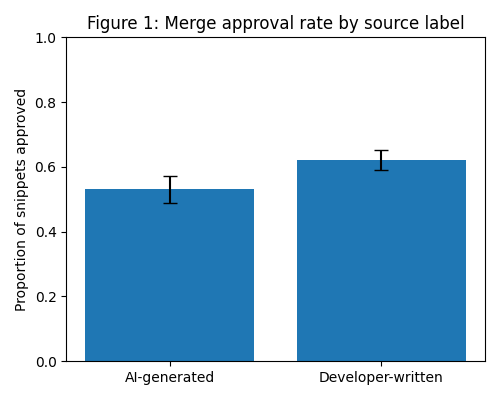
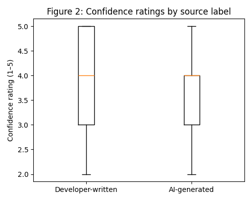
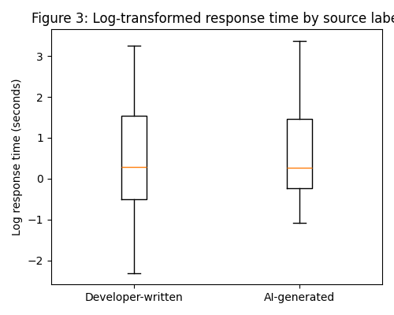

# Automation bias or Algorithmic Aversion? 

# An Empirical Investigation of Source Labels in

## TL;DR

This study examines the effect of source attribution on developers’ evaluation quality of buggy AI-generated code snippets. In this between-subjects experiment, participants reviewed identical Python snippets labelled either as  AI-generated or developer-written. Mixed-effects models revealed no significant effect of label on merge decisions, confidence or merge decision times, despite a small numerical tendency toward lower approval of AI-labelled code. Review behaviour was instead influenced by individual expertise and their AI-tool familiarity. These findings suggest that source labels alone do not reliably affect code-review judgements among experienced developers, refining current understandings of automation biases in human–AI interaction.

## Introduction

With AI-assisted software development becoming the mainstream, a substantial majority of the developers tend to use code generation tools such as GitHub Copilot, Claude Code, etc \[9\]. While these tools massively boost coding capabilities, many also introduce new errors, making rigorous code review crucial \[2\].  In a recent study on developers’ bias towards AI-generated code, Welter et al. (2025) found that programmers accepted buggy suggestions from AI coding assistants with significantly less scrutiny than similar suggestions from their human peers \[1\]. This pattern points out the tendency to over-rely on automated solutions and overlook the underlying mistakes, reflecting automation bias in decision making \[4,7\]. It also underscores the role of source credibility, where information perceived as coming from a highly capable AI agent might receive more superficial evaluation as compared to code labelled as developer-written \[8\].  
During code review, such biases could compromise the quality of code as well as accountability in AI-augmented development \[10\]. To investigate further, this study conducts a controlled between-subjects experiment where developers review identical buggy Python code labelled as either AI-generated or developer-written. By analysing code-merge approval decisions, confidence ratings and review times using mixed-effects logistic regression \[3,6\], this study examines whether source attribution biases developers’ judgements. This study’s findings inform human-centered AI design by emphasising practices that maintain critical human oversight in AI-assisted programming.

## Research Question

Does source attribution (AI-generated vs. developer-written) affect developers’ acceptance of buggy code changes during code review?

## Study Design

### Research Approach

This study uses a **between-subjects experimental design** to test whether **source attribution** (AI-generated vs developer-written) influences developers’ acceptance of buggy code. Participants are randomly assigned to one of two groups that review **identical code snippets**, differing only in the displayed label. Each review task is **time-limited to 30 seconds** to ensure consistent exposure across participants. This deliberate **misattribution of authorship** isolates the causal effect of perceived source credibility, a common and ethically accepted method when followed by debriefing.

The study builds on research showing that **high-credibility sources** receive less critical evaluation (Hovland & Weiss, 1951\) and that humans often exhibit **automation bias**, over-trusting automated aids (Goddard et al., 2011; Dzindolet et al., 2003). Given the widespread use of AI coding tools and evidence of reduced skepticism toward AI-generated code (Apel et al., 2025), this experiment tests whether the *label alone* can bias acceptance behavior.

### Participants

This study recruited 44 participants, comprising Cambridge graduate CS students with at least 6 months Python experience, as well as software developers with over 2 years of professional experience. Participants are randomly assigned (stratified by self-reported AI tool familiarity) to the AI or Human condition (≈22 per arm).

### Materials & procedure

* **Snippets:** 10 validated Python snippets (3–5 lines). Bug types: off-by-one, incorrect conditional, missing return, resource handling, and a small security/logic error.

* **Platform / timing:** Study hosted online (Qualtrics) or run in-person.  Each code-review trial is **limited to 45 seconds**, with a visible countdown and automatic progression once time expires. This duration was chosen through pilot timing and prior HCI practice: 45 seconds is sufficient for quick inspection of short snippets while standardising exposure and maintaining participant engagement. The fixed window ensures comparable cognitive conditions across participants without introducing undue pressure. Total session duration ≈ 10 minutes. Response times are logged automatically.

* **Trial flow:** Pre-survey (experience, AI familiarity, code review frequency) → 10 snippet trials (source label shown before code) → manipulation check and debrief questionnaire → debrief. For each snippet participants answer: (1) Approve? (Yes/No), (2) Confidence (1–5). Two attention checks are embedded to ensure focus.

### Data Analysis

For primary analysis, the effect of source label on approval decisions were modeled using a mixed-effects logistic regression \[3, 6\]. This model included fixed effects of source label and bug status with random intercepts for participants and snippets to account for individual differences and item-level variability. All valid trials were analysed on an intention-to-treat- bias.

Secondary analyses examined whether the source label influenced confidence ratings or decision times, which are common indicators of decision effort in human–AI interaction \[4\]. Confidence scores (1-5) were analysed using a mixed- effect linear model with participant as a random intercept and snippet identity coded as a fixed-factor. Programming experience and AI-tool familiarity were included as covariates to control for individual difference in expertise. Decision times were clipped to the 30-second task time, log-transformed to correct for positive skew, and analysed using mixed-effects linear models with participants as random intercept.

## Literature review

AI coding assistants are now widely adopted by developers.  A recent survey found that about three quarters of developers use or plan to use AI coding tools in their workflow \[9\]. These tools can boost productivity but also introduce new errors into code. Consequently, developers’ code reviews become even more critical. Recent empirical work suggests that developers may scrutinize AI-generated code less rigorously. Welter *et al.* (2025) conducted a controlled study comparing GitHub Copilot (an AI “pair programmer”) with human pair programming. They found that developers **accepted Copilot’s suggestions with significantly less scrutiny** than identical suggestions from a human partner \[1\]. In other words, programmers were more likely to go along with buggy code from “AI” than from a person. This raises the possibility of **automation bias**.

Automation bias is a well-established cognitive phenomenon of exhibiting the tendency to uncritically trust automated output. In a systematic review, Goddard *et al.* (2012) defines automation bias as the tendency to over-rely on automation, failing to notice errors that the system makes \[4\]. Their review highlights how users of decision-support systems often assume the automated suggestions are correct and thus overlook anomalies. Trust in automation can also drown out contrary evidence. For instance, users may ignore manual checks once they believe the AI is “expert”.  This pattern has been observed in multiple domains, including aviation, healthcare, and information systems, where users frequently over-rely on automated aids despite known error rates \[4\]\[7\]\[11\]. These findings suggest that when developers encounter AI-labeled code, similar cognitive shortcuts could cause them to relax their critical scrutiny. In contrast, other studies note that people sometimes exhibit **algorithm aversion**, distrusting algorithmic advice after seeing errors. The balance of these biases in software engineering is not clear, but they point to a complex effect of *perceived authorship* on review decisions.

Human factors play a known role in code review outcomes. Code review is a decision-making process susceptible to social and cognitive biases. For example, studies have shown that reviewers’ perceptions of an author’s identity (gender, experience, etc.) can influence whether a change is accepted. In one field experiment, Murphy‑Hill *et al.* (2021) found that even revealing nothing more than an author’s identity can alter how reviewers judge the change\[10\]. By analogy, labeling a change as “AI-generated” versus “human-written” is a salient cue about the source. If high-tech AI sources are treated as highly credible, reviewers might skim over details. Conversely, if AI is seen as error-prone, reviewers might be extra vigilant. The interplay of these effects in code review has not been studied. The current research question addresses this gap: whether simply attributing identical buggy code to an AI versus a human changes developers’ likelihood of approving it. Understanding this is crucial for designing code review practices and AI tools that maintain code quality.

## Experiment Results

We analysed 388 code-review judgements from 44 participants in a between-subjects experiment where each participant reviewed 10 Python snippets, half of which contained one deliberately-seeded bug. Participants were randomly assigned to one of the two conditions: all snippets labelled as generated by an AI-coding assistant or all snippets labelled as written by a software developer, enabling us to isolate the impact of source attribution on merge decisions. For each snippet, participants indicated whether they would merge it into a codebase, rated their confidence (1-5 Likert scale) and completed the task under a 30-second limit.

### Merge Decisions

*Figure 1: Proportion of snippets approved in each label condition. Approval was slightly lower for AI-labelled code, although this difference was not statistically significant. The pattern indicates a small numerical tendency toward greater caution with AI-labelled snippets, but no reliable effect of source attribution on merge decisions.*

Figure 1 presents the proportion of snippets approved across the two conditions. Participants approved 62.1% of developer-labelled snippets and 53.1% of AI-labelled snippets, a small numerical difference suggesting the tendency to be more cautious with AI-labelled code. However a mixed-effects logistic regression with random intercepts for participants and snippets found that this effect was not statistically significant  (β \= –0.39, OR \= 0.68, p \= 0.115). Bug status had a strong and significant effect causing  buggy snippets to be much less likely to be approved (β \= –0.86, OR \= 0.42, p \< 0.001). The label and bug interaction was not statistically significant either (β \= –0.21, p \= 0.623).

**This result shows that source attribution alone did not significantly increase or decrease developers’ likelihood of approving buggy code.**

This pattern contrasts with prior evidence of automation bias in code review \[1\] and instead suggests broadly similar scrutiny applied across both conditions.

### Confidence Ratings

*Figure 2: Confidence ratings (1–5) for code-review decisions. Confidence ratings were similar across AI-generated and developer-written snippets, indicating that source label did not significantly affect confidence.  Instead, confidence was primarily shaped by experience and AI-tool familiarity.*

Figure 2 shows boxplots of participants’ confidence ratings by condition. Confidence was generally high across both groups, with median ratings of 4 for both AI and developer-labelled snippets. A mixed-effects linear regression that included participant experience and AI familiarity as covariates revealed no significant effect of label on confidence (β \= \-0.070, p \= .632). Bug status likewise had no effect (β \= \-0.069, p \= .374).

Instead, confidence was primarily shaped by individual differences. Participants with greater programming experience and higher familiarity with AI-assisted tools expressed substantially higher certainty in their merge decisions (β \= 0.432, p \< .001 and β \= 0.225, p \= .014 respectively). 

**These findings indicate that confidence of participants’ judgement reflect personal expertise rather than perceived authorship of the code.**

### Response Time

*Figure 3: Log-transformed decision times for AI-labelled and developer-written snippets. Source attribution did not have a significant effect on response time, indicating that participants invested comparable cognitive effort when reviewing code regardless of the label shown.*

Decision times reflect similar patterns. As shown in figure 3, response times were positively skewed. Most decisions were made within 1-3 seconds, with a small number approaching the 30-second boundary. A mixed-effects linear model showed no significant effect of source label on decision time (β \= 0.094, p \= .705), and bug status similarly did not influence approval speed (β \= 0.074, p \= .451). Participants took similar amounts of time to evaluate AI and developer-labelled snippets indicating comparable effort across both conditions.

**Thus, source attribution did not influence the effort participants invested in evaluating buggy code.**

### Summary

Across merge decisions, confidence ratings and response times, the experimental manipulation showed a consistent pattern:

* Numerical differences hint at a slightly lower trust and caution towards AI-generated code.  
* However, no statistically significant effects in any model.

Participants did not exhibit strong automation-bias, instead, they evaluated AI and developer-labelled code with comparable scrutiny. Confidence and decision time were predominantly shaped by individual expertise, suggesting that individuals’ ability played a more substantial role in code-review than source attribution.

## Discussion

The findings of this study diverge from prior empirical evidence on automation bias in code review, most notably the reduced scrutiny reported by Welter et al. (2025) \[1\]. As opposed to these earlier results, this study found no statistically significant effect of source attribution on merge decisions, confidence ratings or decision times. This suggests that the mere presence of an “AI-generated” label does not, on its own, reliably influence code-review behaviour among the developers sample examined.

However, the small numerical tendency toward lower approval rates for AI-labelled snippets (53.1% vs 62.1%) warrants attention. Rather than indicating automation bias, this pattern reflects potential algorithmic aversion. Such dynamic points to the possibility that opposing bias (over-reliance and skepticism) may counteract one another, especially within a highly trained population. Given that the participant pool consisted of a combination of Cambridge CS students and software developers with over 2 years of professional experience, their baseline competence and familiarity with AI-assisted tooling may have mitigated vulnerability to surface-level cues such as source labels. 

Across all three measures, scrutiny appeared consistent across conditions. Confidence and decision time were moulded more strongly by individual programming experience and AI-tool familiarity than by perceived authorship.  This aligns with broader theories of human-automation interaction, where expertise and trust calibration influence the extent to which automated cues affect judgement \[4, 7\]. This experiment results therefore highlight the developer capability and experience as the primary determinant of code-review quality, with source labels exerting little measurable influence.

These findings raise questions about the boundary conditions under which automation bias emerges in software development. Future research should examine whether stronger effects arise among less experienced developers or under time-pressured conditions that constrain deliberative reasoning. Such extensions are essential for understanding how source credibility shapes human-AI interaction in practice.

---

### References

\[1\] Welter, A., Schneider, N., Dick, T., Weis, K., Tinnes, C., Wyrich, M., & Apel, S. (2025). *From Developer Pairs to AI Copilots: A Comparative Study on Knowledge Transfer*. ArXiv.org. [https://arxiv.org/abs/2506.04785](https://arxiv.org/abs/2506.04785) 

\[2\] Stack Overflow. (2024). *2024 Stack Overflow Developer Survey*. Survey.stackoverflow.co. [https://survey.stackoverflow.co/2024/](https://survey.stackoverflow.co/2024/) 

\[3\] Barr, D. J., Levy, R., Scheepers, C., & Tily, H. J. (2013). Random effects structure for confirmatory hypothesis testing: Keep it maximal. *Journal of Memory and Language, 68*(3), 255–278. [https://doi.org/10.1016/j.jml.2012.11.001](https://doi.org/10.1016/j.jml.2012.11.001)

\[4\] Goddard, K., Roudsari, A., & Wyatt, J. C. (2012). Automation bias: a systematic review of frequency, effect mediators, and mitigators. *Journal of the American Medical Informatics Association*, *19(1)*, 121–127. [https://doi.org/10.1136/amiajnl-2011-000089](https://doi.org/10.1136/amiajnl-2011-000089) 

\[5\] Gupta, S. K. (2011). Intention-to-treat concept: A review. *Perspectives in Clinical Research*, *2*(3), 109–112. [https://doi.org/10.4103/2229-3485.83221](https://doi.org/10.4103/2229-3485.83221) 

\[6\] Bolker, B. M., Brooks, M. E., Clark, C. J., Geange, S. W., Poulsen, J. R., Stevens, M. H. H., & White, J.-S. S. (2009). Generalized linear mixed models: A practical guide for ecology and evolution. *Trends in Ecology & Evolution, 24*(3), 127–135. [https://doi.org/10.1016/j.tree.2008.10.008](https://doi.org/10.1016/j.tree.2008.10.008) 

\[7\] Dzindolet, M. T., Peterson, S. A., Pomranky, R. A., Pierce, L. G., & Beck, H. P. (2003). The role of trust in automation reliance. *International Journal of Human-Computer Studies*, *58(6)*, 697–718. [https://doi.org/10.1016/s1071-5819(03)00038-7](https://doi.org/10.1016/s1071-5819\(03\)00038-7) 

\[8\] Hovland, C. I., & Weiss, W. (1951). The Influence of Source Credibility on Communication Effectiveness. *The Public Opinion Quarterly*, *15*(4), 635–650. [https://www.jstor.org/stable/2745952](https://www.jstor.org/stable/2745952) 

\[9\] Where developers feel AI coding tools are working—and where they’re missing the mark *\- Stack Overflow*. (2024, September 23). Stackoverflow.blog. [https://stackoverflow.blog/2024/09/23/where-developers-feel-ai-coding-tools-are-working-and-where-they-re-missing-the-mark/](https://stackoverflow.blog/2024/09/23/where-developers-feel-ai-coding-tools-are-working-and-where-they-re-missing-the-mark/) 

\[10\] Murphy-Hill, E., Dicker, J., Hodges, M. M., Egelman, C. D., Jaspan, C., Cheng, L., Kammer, E., Holtz, B., Jorde, M. A., Dolan, A. K., & Green, C. (2022). Engineering Impacts of Anonymous Author Code Review: A Field Experiment. *IEEE Transactions on Software Engineering*, *48*(7), 2495–2509. [https://doi.org/10.1109/tse.2021.3061527](https://doi.org/10.1109/tse.2021.3061527) 

\[11\] Mosier, K. L., Skitka, L. J., Heers, S., & Burdick, M. (1998). Automation Bias: Decision Making and Performance in High-Tech Cockpits. *The International Journal of Aviation Psychology*, *8*(1), 47–63. [https://doi.org/10.1207/s15327108ijap0801\_3](https://doi.org/10.1207/s15327108ijap0801_3) 
